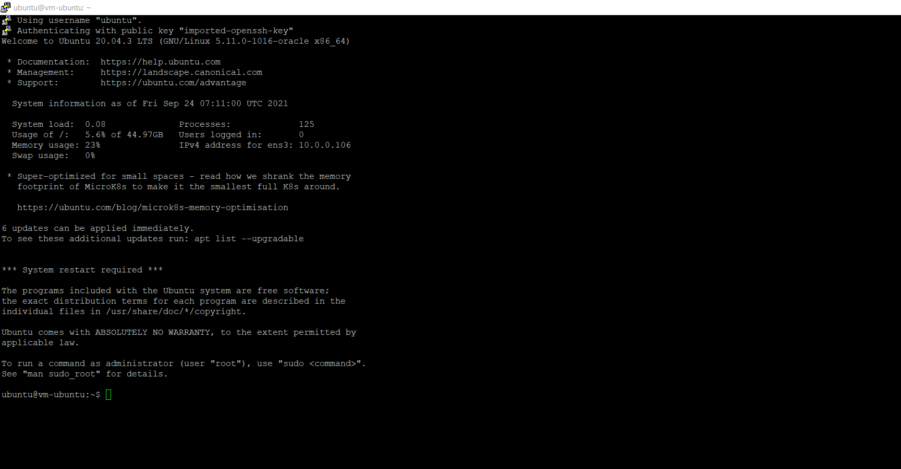

# 03 - Membuat Virtual Machine

## Tujuan Pembelajaran

1. Mengetahui layanan Oracle Cloud Infrastructure Computer
2. Mampu membuat Virtual Machine (VM) di layanan compute Oracle Cloud

## Hasil Praktikum

Berikut ini adalah bukti telah berhasil membuat Virtual Machine pada oracle cloud sesuai dengan praktikum.

 
## Tugas
Carilah cara agar Anda dapat melakukan SSH ke VM yang baru dibuat berdasarkan praktikum tersebut! Lalu buatlah laporan praktikumnya!

Jawaban :

- Pertama download dan Install PuTTY kemudian Open PuTTYGen dan load key yang telah disimpan pada direktori anda.

- Setelah key berhasil di load kemudian tekan save private key dan simpan key dengan nama ubuntukey lalu tekan save.

- selanjutnya PuTTY, pada hostname isi sesuai dengan username dan public ip address vm anda disini saya isi dengan ubuntu@152.70.84.135 sesuai dengan VM saya, port 22 dan connection type SSH

- Pada category connection expand, lalu pada ssh expand pilih auth kemudian pada private key file for authenthication pilih file .ppk yang telah kita save tadi menggunakan PuTTYgen. bila sudah tekan open.

5. Ini adalah tampilan jika berhasil connect ssh ke instance vm kita.
