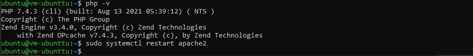

# 04 - Virtual Clout Network (VCN)

## Tujuan Pembelajaran

1. Mengetahui layanan Oracle Cloud Infrastructure Networking
2. Mampu mengaktifkan port 80 melalui Virtual Cloud Network (VCN) di layanan 
Oracle Cloud
3. Mampu memasang Apache server dan mengonfigurasi IP tables Firewalls

## Praktikum 1: Mengaktifkan Port 80 melalui VCN di Oracle Cloud

1. Menambahkan ingress rules.

## Praktikum 2: Setup Apache di VM

1. Akses VM dengan CMD

2. Install apache server

3. Jalankan service apache

4. Aktifkan firewall dan update iptables.

5. Uji server VM.

## Tugas

Install PHP pada vm

1. jalankan pada vm sudo apt -y install php libapache2-mod-php

2. cek versi php dan restart apache

3. buat file php dengan jalankan sudo vi /var/www/html/hello.php, dan masukkan text helloworld pada PHP.

4. cek pada ip public http://140.83.54.14/hello.php

