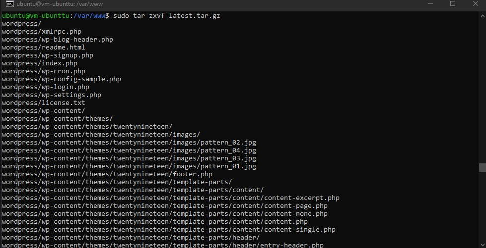

# 06 - Kuis

## Setup Wordpress VM + DB

1. Create DB

2. Config VCN (menambahkan ingress rules)

3. Install dan akses mysql melalui SSH

4. Install wordpress pada PaaS    

     

5. Download wordpress dan ekstrak wordpress

6. install ektensi mysql pada php dan aktifkan ekstensi mysql.

7. Installasi wordpress via browser

8. Hasil wordpress akses di : http://152.70.84.135/index.php/2021/10/12/hello-world/

