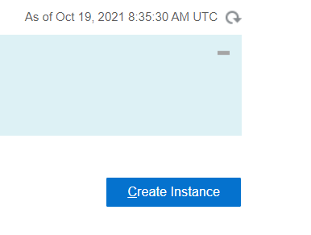
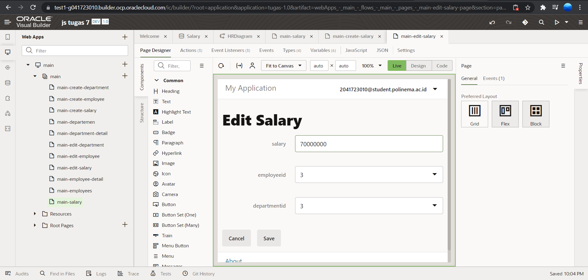

# 07 - Setup SaaS (Software as a Service)

## Tujuan Pembelajaran

1. Mengetahui layanan Oracle Cloud Infrasturcture Software as a Service.
2. Mampu mengguankan layanan software layanan oracle.

## Hasil Praktikum

- Membuat Aplikasi (Create Web Application)
Login OCI -> Pilih OCI Classic Service -> Create Instace

- OCI Classic Service -> Create Instace

- Isi nama instace, nama, deskripsi dari instance, Region dan tag

- Hasil instance yang telah dibuat kemudian terdapat simbol menu (klik simbol tersebut dan akan muncul menu beriku), 
Kemudian pilih Open Visual Builder Home Page 

- Tunggu beberapa saat, kemudian jika berhasil akan muncul halaman berikut. Klik New Application

- Isi informasi tentang aplikasi yang akan dibuat :

- Pada sisi kiri adalah menu dari (kotak berwarna merah) visual builder dari aplikasi yang akan kita 
buat, pilih ikon web kemudian akan muncul menu berikut : 

- Expand hrwebapp, kita akan melihat struktur struktur dari aplikasi web, kurang lebih seperti 
gambar dibawah ini:

## Import Location Busines dari file

-  Klik Busines Object , pada tab navigator:

- Pada dialog box Busines Object, isi field label dengan “Location” kemudian tekan tombol create 
(pada field name akan otomatis terisi) dan Klik Field tab

- Klik field tab

-  Pada property instpector, centang Required di bawah label constrain.

- Pilih Impor From File.

## Department Business Object

- Pada panel Business Objects, klik tanda +, lalu pilih Business Object

## Employee Business Object

Ikuti seperti laporan

Klik tab Endpoints dan lihat API resource dan REST end point yang dibuat untuk Business Object
Empoyee. Karena Object Employee merujuk ke Department, kita dapat melihat end point untuk 
kedua objek terseut jika Anda memperluas node departmentObject. Perluas node Resource API 
untuk melihat URL untuk mengakses metadata dan data untuk objek bisnis, lalu perkecil lagi.

- Di panel Objek Bisnis Navigator, klik tab Diagram, lalu klik tombol + busines object diagram lalu Pada properti inspector, pilih semua

- Kurang lebih diagram yang dihasilkan seperti ini:

## Main-start Page untuk Display Departments

- Pada heading property inspector, isi text field dengan “ Departments” dan beri table 

tambah kan button create

- lakukan tambah data seperti jobsheet lalu halaman main-start, bisa kita lihat data pada tabel telah ditambahkan

## Halaman Create untuk Employee Busines Object

- - Pada heading property inspector, isi text field dengan “ Employee dan beri table 

- kemudia coba tambahkan data seperti jobsheet

- setelah ditambahkan maka data akan muncul seperti dibawah ini

## Action Chain halaman Departments ke halaman Employess

- Ikuti langkah seperti jobsheet lalu Drag Navigate action dari Navigation section yang ada di Action Palatte ke tanda + dibawah 
action start

## Import Data ke Busines Object

Klik Departement kemudian klik Data tab, kemudian akan tampil jenis object yang telah kita 
buat tadi lalu Klik Import from File

- Ulangi langkah yang sama (langkah 1-4) untuk import data Employee menggunakan file 
Employee.csv

## Halaman Detail untuk Department Busines Object

## Employee Business Object
- Create data

- Detail Employee 

- Edit Employee

- Kemudian delete Employee

## Stage and Publish

- Kembali ke halaman utama Visual Builder dan Pada aplikasi yang telah dibuat klik Options , kemudian select Stage.

- Setelah kita berhasil menguji aplikasi pada tahab sebelum, kita dapat mempublikasikannya dan 
membuat aplikasi live. Aplikasi langsung dapat dilihat oleh pengguna dengan kredensial yang tepat.

# Tugas

Pertama membuat Database Salary beserta relasi database

Setelah itu membuat heading Main-salary salary create, edit, delete dan detail

menambahkan button Display Salary pada Department
