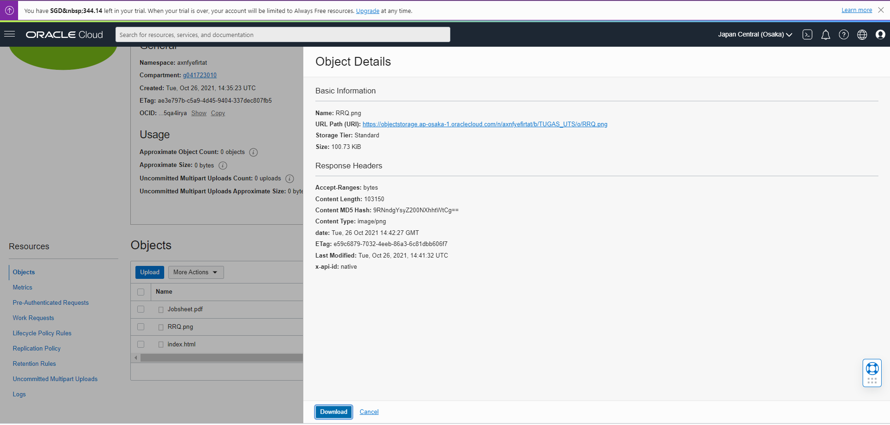
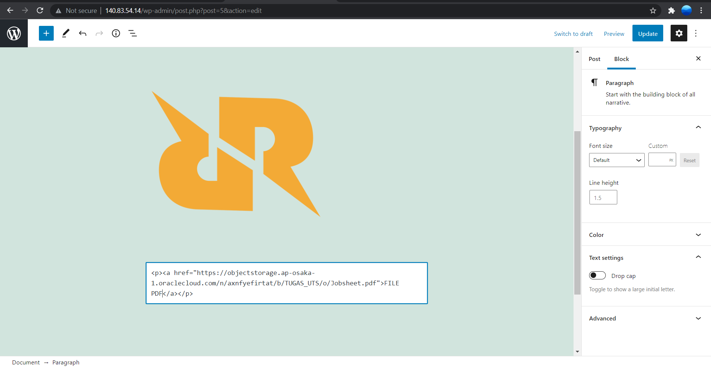

# 08 - UTS

## UTS Komputasi Awan

Untuk MK Komputasi Awan nanti tidak ada kelas daring & info dr Puskom portal/LMS sdg pemeliharaan server.
Agenda hari ini diganti UTS dg spesifikasi use case spt berikut:

Silakan masing-masing individu memanfaatkan object storage sebagai media penyimpanan assets (gambar, file2 upload, dsb) berdasarkan project Kuis 1 kemarin yaitu aplikasi Wordpress.
Sehingga hasil akhir utk UTS aplikasi dpt memanfaatkan VM, DB instance dan Object Storage.
Buatlah laporan di masing-masing repo private GitHub Anda!
Deadline 2 Nov 2021 Jam 07:00 WIB.

## Hasil UTS

1. Login ke halaman admin wordpress masing - masing.

2. Buat post baru

3. Buka oracle cloud lalu buatlah bucket object storage baru untuk menyimpan file. Atur visibilitas menjadi public

4. Upload file gambar, materi dan file pendukung.

5. Kembali ke halaman editor post admin wordpress, masukkan link yang telah diupload.

Insert gambar

pada blocks cari image

copy link image dari view object detail

Hasil :

Insert File Pendukung (pdf)

pada blocks pilih embed

copy link image dari view object detail

kemudian conveert to link

Hasil :

Insert file index

sama seperti sebelumnya pilih embed

kemudian convert lo link

edit file

klik file index

Hasil :

Test Wordpress :

Link Wordpress : http://152.70.87.120/index.php/2021/10/26/uts/
