# 10 - Docker

## Tujuan Pembelajaran
- Mengemas aplikasi dengan semua dependensi yang dibutuhkannya ke dalam sebuah standar untuk deployment
- Docker membungkus semuanya menjadi sistem file lengkap yang berisi semuanya kebutuhan aplikasi dan yang menjalankan mesin virtual itu sendiri.
- Proses packaging tersebut ke dalam sebuah image lengkap dan menjamin bahwa itu portable, ketika menjalankan dilakukan dengan cara yang sama, tidak memperdulikan environment deployment yang digunakan.

## Praktikum
### Install Docker
- install docker kemudian masuk ke virtual mesin dan jalankan perintah di bawah ini
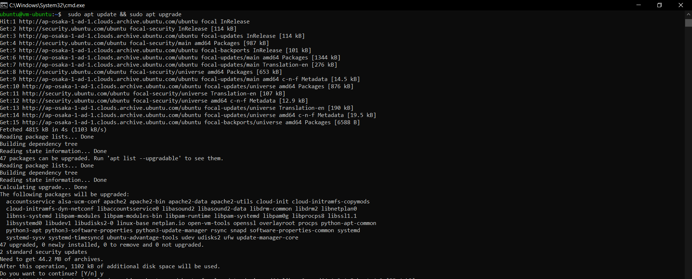
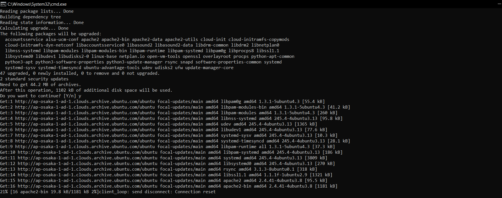

- Install paket yang dibutuhkan sebelum melakukan installasi docker jalankan perintah di bawah ini
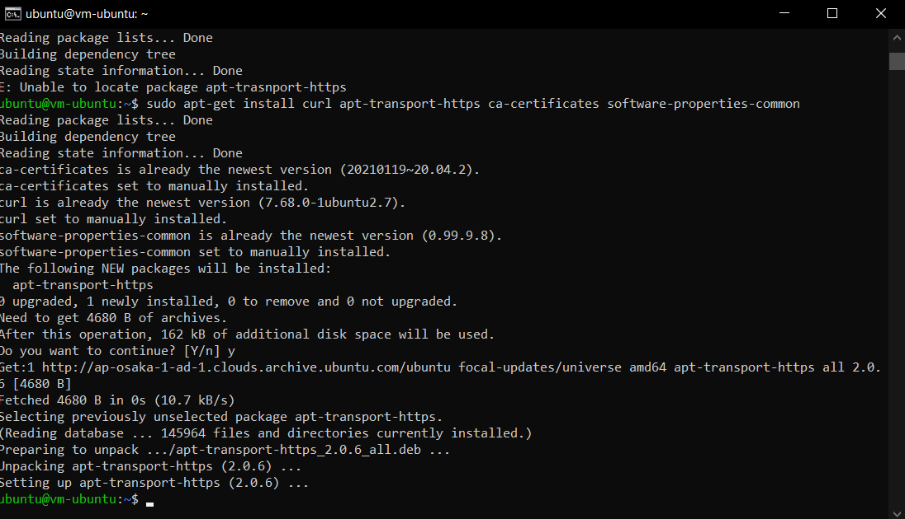

- Langkah selanjutnya yaitu menambahkan repository docker, dengan beberapa baris perintah di bawah ini
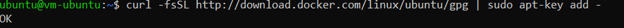
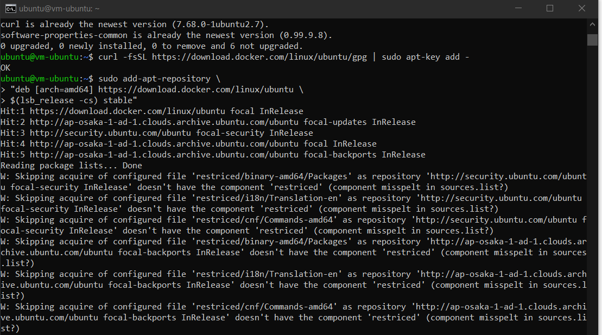
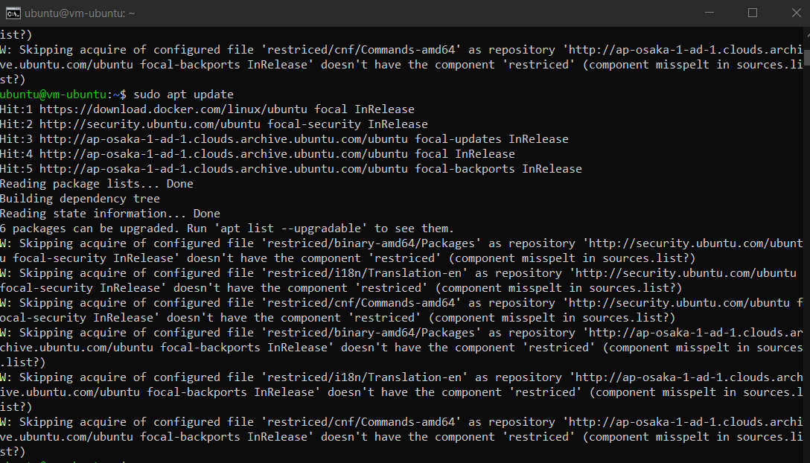
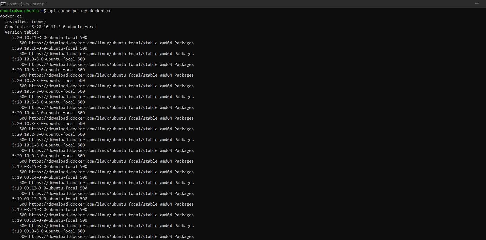

- Silakan lakukan installasi menggunakan perintah berikut ini
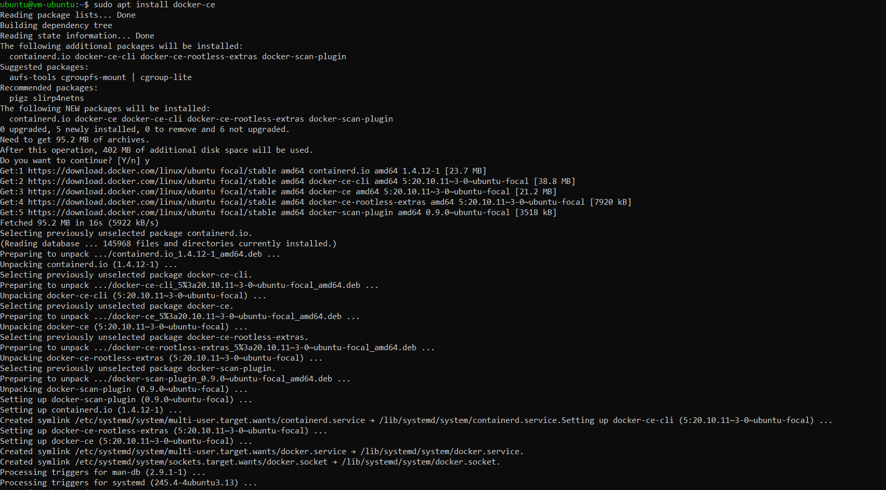

- Untuk memastikan kembali, kita butuh menggunakan image test apakah docker benarbenar berjalan sebagaimana semestinya. Gunakan perintah di bawah ini
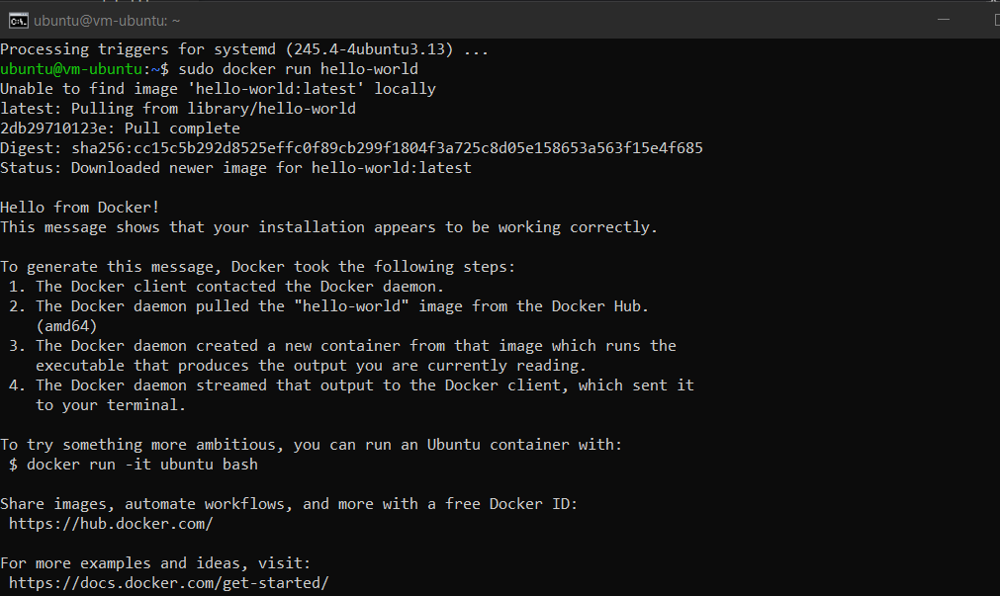

- Agar memberikan perubahan, logout terlebih dahulu kemudian login kembali. Jalankan perintah docker tanpa menggunakan sudo seperti berikut
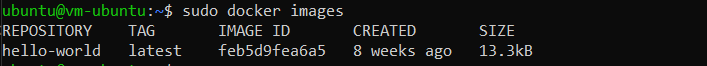

### Membuat Container
- Ketika kita mengembangkan aplikasi web tentunya membutuhkan sebuah web server, hal yang sering dilakukan dengan melakukan installasi paket  tersebut diikuti dengan Langkah-langkah yang lain. Dengan docker, kita cukup satu baris perintah apache sudah bisa berjalan. Berikut ini perintahnya 
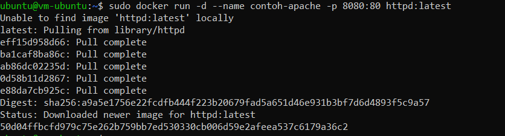
- Perintah di atas digunakan untuk membuat container dengan nama contoh-apache dengan mengexpose port 8080 dari port defaultnya 80, sedangkan image yang digunakan adalah httpd yang merupakan layanan web server apache. Parameter -d digunakan untuk menjalankan containersecara background. Silakan cek menggunakan telnet seharusnya sudah bisa terhubung seperti pada gambar berikut
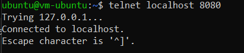

### Membuat Akun Docker Hub
- Silakan menuju halaman https://hub.docker.com/signup, akan memuat halaman berikut
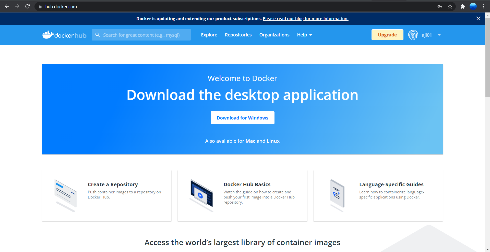

- Kemudian lihat repository
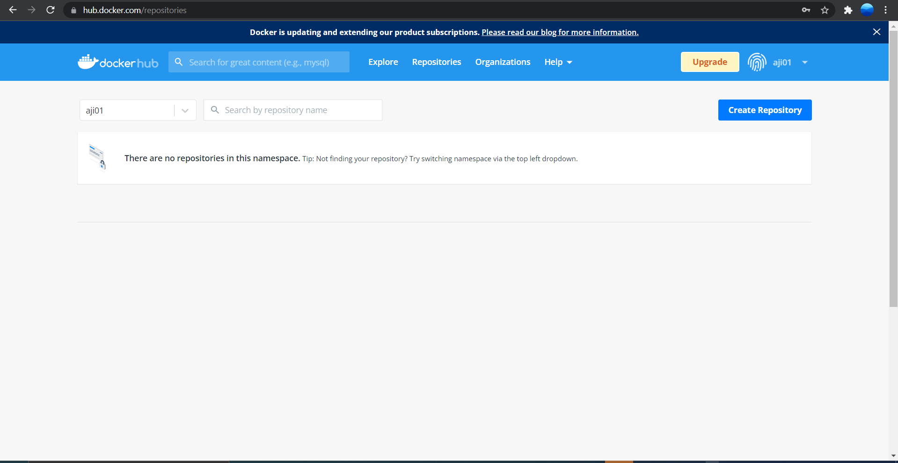

### Build Image
- Clone project yang terdapat di https://gitlab.com/0d3ng/cloud-docker-java-sample.git
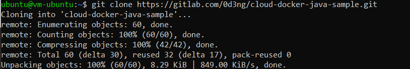

- masuk ke dalam direktori tersebut dan jalankan perintah build seperti berikut
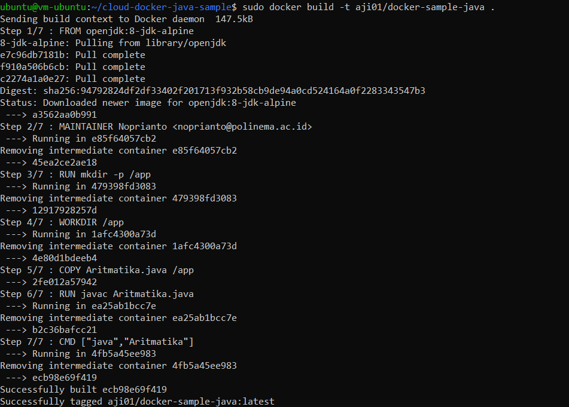

- Jika kita ingin upload ke docker hub kita, silakan login dulu menggunakan perintah di bawah
ini
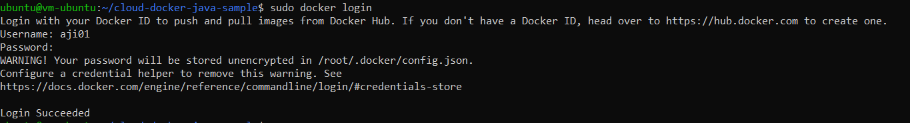

- Selanjutnya kita upload image yang telah kita buat menggunakan perintah di bawah ini
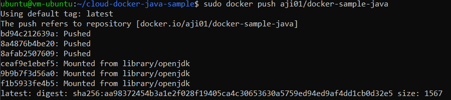

- Setelah itu cek docker hub jika berhasil maka akan muncul tampilan seperti ini
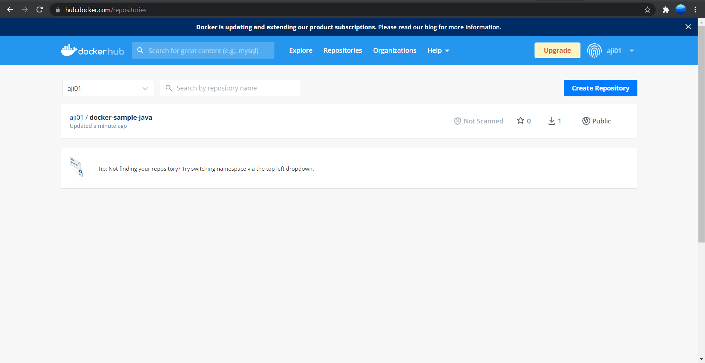