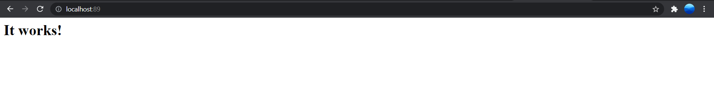

# 11 - Docker Network Bridge

## Tujuan Pembelajaran mempelajari tentang :

1. Docker network bridge
2. Docker network host
3. docker network none
4. Perintah networking docker
5. expose dan mapping port
6. persistent storage
7. perintah docker volume 
8. Docker Volume Driver
9. Docker Compose
10. Perintah Dasar Docker Compose

## Hasil Praktikum

### 1. Docker Network

#### Membuat dan memeriksa docker network

- Pertama ketik perintah di bawah ini untuk mengetahui network yang tersedia pada docker host kita

 - Selanjutnya untuk mengetahui perintah-perintah dasar yang bisa digunakan untuk docker network

 - Untuk membuat network bisa menggunakan perintah create seperti pada gambar di bawah ini

 - Selanjutnya cek network yang sudah dibuat menggunkan perintah ls, seharusnya akan menambahkan network. Hasilnya adalah sebagai berikut

- Terakhir, ketika ingin mengetahui informasi detail dari network yang telah kita buat bisa menggunakan perintah inspect

#### Menghubungkan Container ke Network

- Buat terlebih dahulu contoh container, misalkan kita akan membuat container linux yaitu busybox.

- Buat container yang kedua menggunakan image linux alphine, buka windows yang baru agar container1 tetap berjalan

- Kemudian cek masing-masing container tersebut menggunakan perintah ps untuk mengetahui status container yang sedang jalan. Buka windows baru, jalankan perintah berikut

- Kemudian jalankan inspect untuk mengetahui informasi detail dari masing-masing container.

- Untuk membuktikan silakan ping dari container1 ke container2, seharusnya akan reply.

#### Membuka Port Container

- Untuk membuktikan silakan ping dari container1 ke container2, seharusnya akan reply.

- Anda bisa ngetik pada browser seperti ditunjukkan di bawah ini seharusnya akan reply.

### 2. Docker Volume
 
#### Membuat Volume

- Buatlah folder dahulu, Selanjutkan jalankan perintah dengan menambahkan parameter -v seperti berikut untuk mapping ke container yang akan kita buat, jangan lupa untuk masuk direktori volume, dan membuat file log.txt

- cek folder pada directory

- cek volume yang telah ada dan buat volume.

- Jalankan container dengan menyertakan volume yang telah kita sebelumnya dan buat file log.txt, jangan lupa masuk ke direktori volume terlebih dahlulu.

- Buat container yang lain, dengan mengulangi langkah yang sama sebelumnya. Ketik perintah ls untuk mengetahui isi folder volume

#### Menghapus Volume

- untuk menghapus volume jalankan dengan cara dibawah ini :

### 3. Docker Compose

- Silakan masuk ke oracle cloud dan ke VM Anda, kemudian install docker compose dengan perintah sudo curl -L "https://github.com/docker/compose/releases/download/1.27.4/docker-compose-(uname -s)-(uname−s)−(uname -m)" -o /usr/local/bin/docker-compose

- Ubah docker compose menjadi executable dan Cek versi docker compose untuk memastikan proses installasi berhasil dilakukan dengan perintah

- Clone repo yang telah disediakan menggunakan git atau download secara manual.

- Masuk ke direktori tersebut dan ganti branch menjadi cloud-docker dengan perintah seperti berikut ini

- Build image tersebut menggunakan perintah build pada docker.akan tetapi mengalami eror ketika docker built -t

- Selanjutnya buat folder data di bawah /opt agar data mysql tidak hilang ketika container dihapus

- Jalankan docker, akan tetapi masih eror

