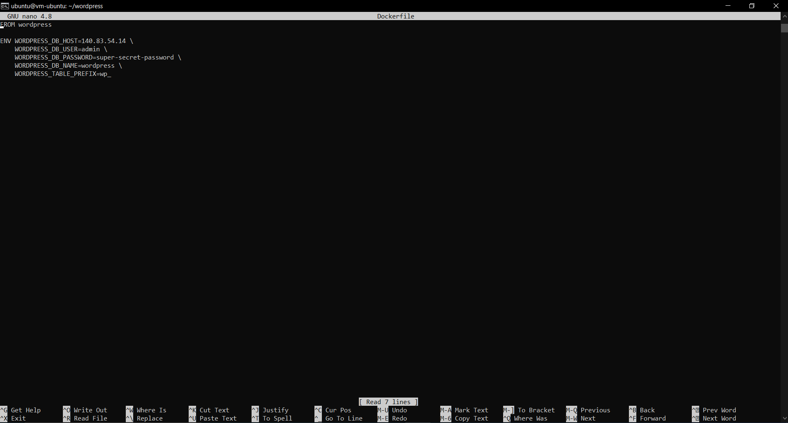

# 013 - Kuis

Buatlah docker image dari project UTS kemarin di push ke docker hub.
Waktu pengumpulan sampai jam 12 siang nanti, dibuktikan dengan push Laporan/SS ke repo masing-masing.

## Set Up Dockerfile

1. jalankan perintah sudo touch Dockerfile kemudian masuk ke worpress dan  edit file Dockerfile dengan sudo nano Dockerfile

## Build Image

1. Jalankan dengan perintah sudo docker login untuk login ke docker

2. Jalankan perintah sudo docker build -t aji01/wordpress .
    untuk menjalankan build image

3. cek apakah image berhasil dibuat dengan menjalankan sudo docker images. lihat apakah images dengan aji01/wordpress muncul atau tidak.

## Docker Push

1. Jalankan "sudo docker push aji01/wordpress" untuk menjalankan perintah push ke repository di docker

2. cek pada halaman web docker apakah images berhasil di push.

