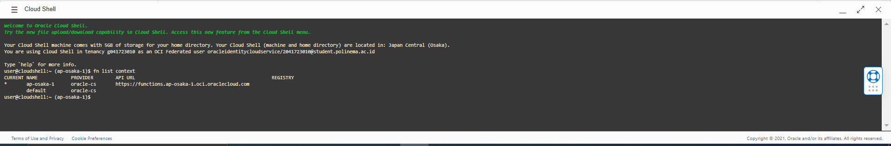

# 14 Serverless

## 1.1 Membuat Application dan Function

- Masuk ke akun https://cloud.oracle.com dan navigasi ke menu Developer Services -> Applications

- lalu new aplication

- setelah ini akan muncul halaman Getting Started.

- Aktifkan Cloud Shell dengan menekan tombol Launch Cloud Shell.

- buat [repo-name-prefix] menjadi yudhaerian

- kemudian generate token

- ubah deskripsi menjadi faas setelah itu copas token saat login

- login dan masukkan token tadi

- jika berhasil maka tampilan nya seperti ini

- ikuti langka" selajutnya setelah login

- deploy

- tunggu hingga selesai jika berhasil maka akan muncul seperti ini

- tampilkan hello world

- Navigasi menu ke Functions di sebelah kiri bawah. Anda akan mendapatkan detil fungsi yang tersedia. Pada halaman ini terdapat informasi mengenai Functions, serta invoke endpoint yang dapat digunakan untuk pemanggilan function

## 1.2 Memanggil Funcion

- Salin invoke endpoint kemudian panggil dengan format perintah seperti di jobsheet

